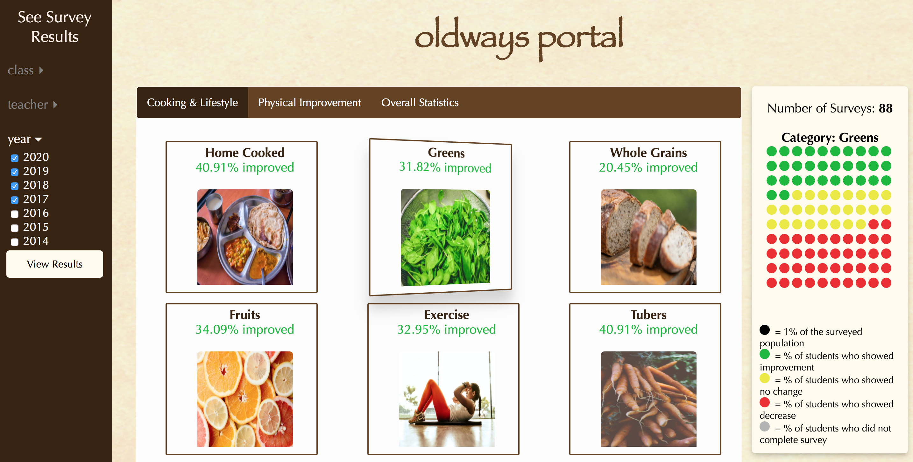
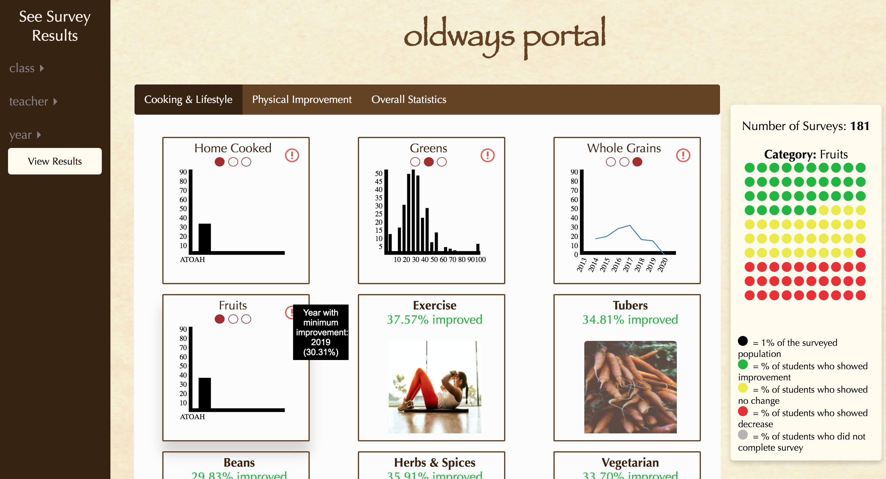

 # Oldways Survey Visualization
 Team Members: Mattie Wasiak, Andrea Jaba and Haripriya Mehta
 
 Please view visualization here: https://github.mit.edu/pages/6894-sp20/FP-Oldways-Data-Visualization/
 
 Please view paper here: https://github.mit.edu/6894-sp20/FP-Oldways-Data-Visualization/blob/master/Oldways_Survey_Visualization.pdf
 
Each member equally contributed to each part of the project. Work was primarily split among group members in the following way:
 
 ## Mattie
 * Generating Dummy Data for the purpose of visualization
 * Green, Yellow, Red Dot Student Distribution Summary Panel
 * Graphs for the backside of the card
 * Communicating with Oldways Organization

 ## Andrea
 * Creating cards for each category
 * Generating statistics for Data on front side of the card
 * Flipping effect of individual cards
 * Warning Sign on categories that need to be observed
 
 
## Haripriya
* Loading Page, Page Layout & Images
* Filtering 
* Tabs for Different Categories 
* Channeling Data to backside of the card and Horizontal Navigation Dots

## Development Process

We have been working with a nutrition non-profit, Oldways, that holds cooking classes teaching students to be healthier. Oldways has data through surveys from teachers and students to see how each class is going and how students have improved over the duration of the class. They wanted us to create a data visualization tool to generate statistics and graphs using this data such that they can easily see student performance summaries grouped by class, by teacher, and by year. 

As our final project, we made a tool which initially displays high level survey statistics that are averaged across all classes for all years and then give the user the ability to filter within these statistics to get a lower level breakdown. Additionally, we have added markers to direct the user's attention to certain noteworthy things in the data, such as a struggling class, as well as including a survey panel that color codes students based on whether or not they have improved in a specific category after taking the class.

We have made our project very interactive in order to make the rather mundane task of analyzing survey data slightly more interesting :) We strongly believe that the interactivity also drives the user to truly understand what data (specifically, what classes, teachers and years) is being visualized.

Overall, the three of us learned a lot about web development and interactive visualizations along the way and we are very happy with the final visualization that we have produced. We hope that Oldways will be able to utilize this visualization and hopefully, quickly intervene in cases where students are not being benefitted by a class.
